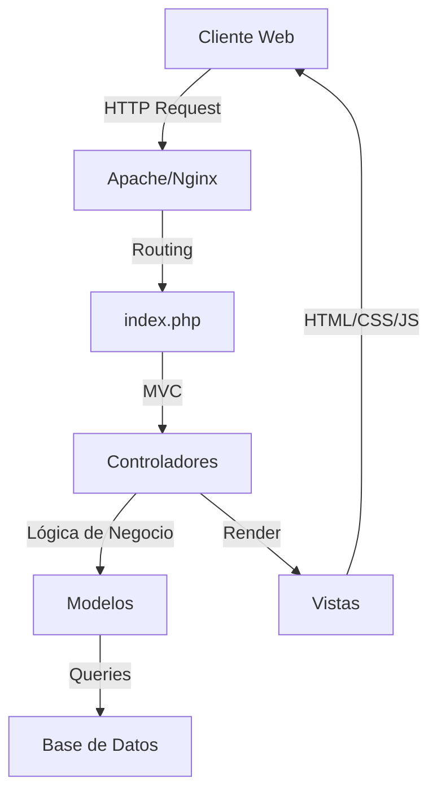
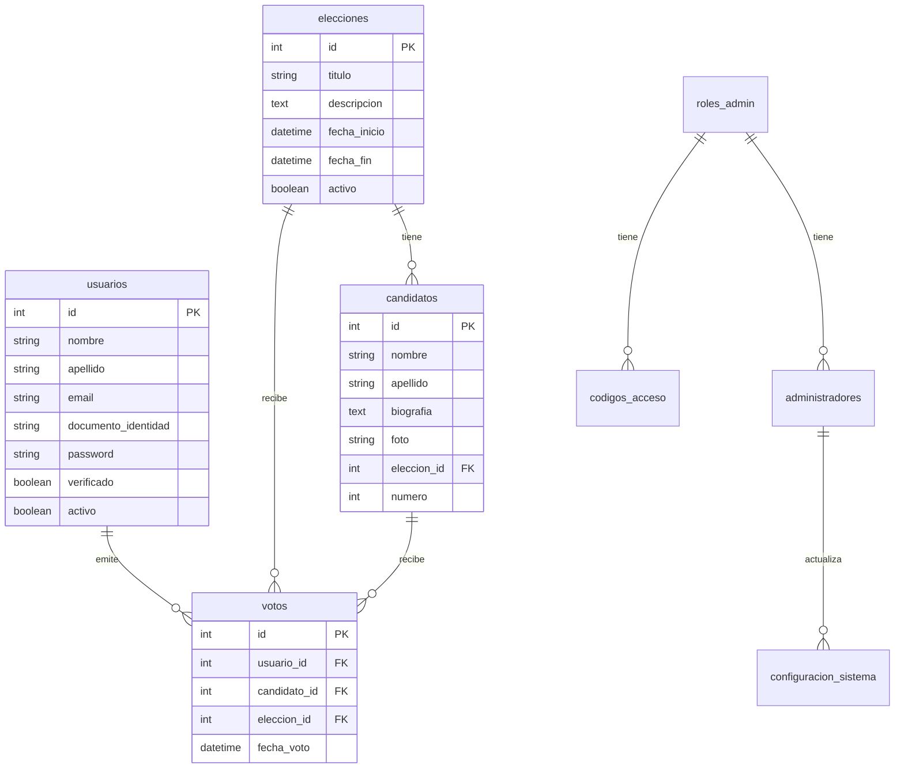

# Sistema de Votación Pro

Sistema de votación electrónica profesional y seguro.

## Requisitos del Sistema

- PHP 7.4 o superior
- MySQL 8.0 o superior
- Composer
- Git

## Instalación Local

1. Clonar el repositorio:
```bash
git clone [URL_DEL_REPOSITORIO]
cd sistema_votacion_pro
```

2. Instalar dependencias:
```bash
composer install
```

3. Configurar la base de datos:
- Crear una base de datos MySQL
- Importar el archivo `database.sql`
- Configurar las credenciales en `config/database.php`

4. Configurar el servidor web:
- Apuntar el DocumentRoot a la carpeta `public/`
- Asegurarse de que mod_rewrite esté habilitado

## Despliegue en Heroku

1. Instalar Heroku CLI:
```bash
# Windows
winget install --id=Heroku.HerokuCLI

# macOS
brew tap heroku/brew && brew install heroku
```

2. Iniciar sesión en Heroku:
```bash
heroku login
```

3. Crear una nueva aplicación en Heroku:
```bash
heroku create tu-nombre-app
```

4. Agregar base de datos PostgreSQL:
```bash
heroku addons:create heroku-postgresql:hobby-dev
```

5. Configurar variables de entorno:
```bash
heroku config:set APP_ENV=production
heroku config:set APP_DEBUG=false
```

6. Desplegar la aplicación:
```bash
git push heroku main
```

7. Ejecutar migraciones:
```bash
heroku run php database/migrate.php
```

## Configuración Inicial

1. Crear un administrador inicial:
```sql
INSERT INTO roles_admin (nombre, descripcion) VALUES 
('Super Administrador', 'Control total del sistema'),
('Administrador', 'Gestión de elecciones y candidatos');

INSERT INTO administradores (nombre, apellido, username, email, password, rol_id, activo, fecha_registro) 
VALUES ('Admin', 'Sistema', 'admin', 'admin@sistema.com', '$2y$10$8tDjLmH1EgQzOEG9jHnUWuQB6YhP.YS9TcF9.TTQtGMOmqHK4LEoO', 1, 1, NOW());
```

2. Configurar el sistema:
- Acceder al panel de administración
- Configurar los colores y temas
- Establecer la información del sistema

## Estructura de la Base de Datos

El sistema utiliza las siguientes tablas principales:

- `administradores`: Gestión de administradores del sistema
- `usuarios`: Registro de votantes
- `elecciones`: Configuración de procesos electorales
- `candidatos`: Información de candidatos
- `votos`: Registro de votos emitidos
- `configuracion`: Configuración general del sistema
- `roles_admin`: Roles de administración
- `codigos_acceso`: Códigos de acceso para registro

## Seguridad

- Todas las contraseñas están hasheadas con bcrypt
- Implementación de tokens CSRF
- Validación de sesiones
- Protección contra SQL Injection
- Sanitización de entradas

## Soporte

Para reportar problemas o solicitar ayuda:
- Crear un issue en el repositorio
- Contactar al equipo de soporte

## Licencia

Este proyecto está bajo la Licencia MIT.

## Descripción del Proyecto

Sistema de Votación Pro es una plataforma electrónica segura y eficiente diseñada para gestionar y realizar procesos de votación en línea. Permite la creación de diferentes tipos de elecciones, la gestión de candidatos y usuarios, y la emisión de votos de manera segura y verificable. Cuenta con paneles de administración y usuario para una gestión y participación diferenciada.

## Características Principales

*   Gestión de Elecciones (creación, edición, activación/desactivación)
*   Gestión de Candidatos asociados a elecciones
*   Registro y autenticación de Usuarios (con roles diferenciados: usuario, administrador, administrador supremo)
*   Emisión de Votos por parte de usuarios verificados
*   Visualización de Resultados de elecciones (para administradores)
*   Panel de Administración con diferentes niveles de acceso
*   Panel de Usuario para ver elecciones activas y emitir votos
*   Configuración del sistema (zona horaria, personalización visual, etc.)

## Estructura del Proyecto

```
sistema_votacion_pro/
├── admin/                 # Panel de administración
├── assets/               # Recursos estáticos (CSS, JS, imágenes)
├── config/               # Archivos de configuración
├── controllers/          # Controladores MVC
├── database/             # Scripts y migraciones de base de datos
├── debug_logs/           # Logs de depuración
├── helpers/              # Funciones auxiliares
├── logs/                 # Logs del sistema
├── models/               # Modelos MVC
├── public/               # Punto de entrada público
├── uploads/              # Archivos subidos por usuarios
├── views/                # Vistas MVC
├── .htaccess             # Configuración de Apache
├── admin_supreme.php     # Panel de administrador supremo
├── composer.json         # Dependencias PHP
├── database.sql          # Estructura de la base de datos
├── index.php            # Punto de entrada principal
└── README.md            # Este archivo
```

## Diagrama de Arquitectura



## Diagrama de Base de Datos



## Instalación Detallada

### 1. Preparación del Entorno

#### Windows (usando XAMPP/Laragon):
1. Instala XAMPP o Laragon
2. Inicia Apache y MySQL desde el panel de control
3. Asegúrate que los servicios estén corriendo en los puertos 80 (Apache) y 3306 (MySQL)

#### Windows (Apache Nativo):
1. Instala Apache desde [Apache Lounge](https://www.apachelounge.com/download/)
2. Instala PHP desde [Windows PHP](https://windows.php.net/download/)
3. Instala MySQL desde [MySQL Community Server](https://dev.mysql.com/downloads/mysql/)
4. Configura las variables de entorno:
   ```batch
   setx PATH "%PATH%;C:\Apache24\bin;C:\php;C:\mysql\bin"
   ```
5. Copia php.ini-development a php.ini y habilita las extensiones necesarias
6. Configura Apache para usar PHP:
   ```apache
   LoadModule php_module "C:/php/php8.x.dll"
   AddHandler application/x-httpd-php .php
   PHPIniDir "C:/php"
   ```

#### Linux (Ubuntu/Debian):
```bash
sudo apt update
sudo apt install apache2 mysql-server php php-mysql php-mbstring php-json php-gd php-xml php-curl
sudo a2enmod rewrite
sudo systemctl restart apache2
```

#### Linux (Fedora/RHEL):
```bash
sudo dnf update
sudo dnf install httpd mysql-server php php-mysqlnd php-mbstring php-json php-gd php-xml php-curl
sudo systemctl enable --now httpd
sudo systemctl enable --now mysqld
```

#### macOS (Apache Nativo):
1. Apache viene preinstalado, habilítalo:
   ```bash
   sudo apachectl start
   ```
2. Instala PHP y MySQL:
   ```bash
   brew install php mysql
   ```
3. Configura PHP en Apache:
   ```bash
   sudo nano /etc/apache2/httpd.conf
   # Descomenta la línea: LoadModule php_module libexec/apache2/libphp.so
   ```

### 2. Configuración del Proyecto

1. **Clonar el repositorio:**
```bash
git clone <URL_DEL_REPOSITORIO>
cd sistema_votacion_pro
```

2. **Configurar permisos:**
```bash
# Linux/Mac
chmod -R 755 .
chmod -R 777 uploads/
chmod -R 777 logs/
chmod -R 777 debug_logs/
```

3. **Configurar la base de datos:**
```sql
CREATE DATABASE sistema_votacion_pro CHARACTER SET utf8mb4 COLLATE utf8mb4_unicode_ci;
```

4. **Importar la estructura:**
```bash
mysql -u root -p sistema_votacion_pro < database.sql
```

5. **Configurar la conexión:**
```php
// config/dbconfig.php
define('DB_HOST', 'localhost');
define('DB_USER', 'tu_usuario');
define('DB_PASS', 'tu_contraseña');
define('DB_NAME', 'sistema_votacion_pro');
```

### 3. Configuración del Servidor Web

#### Apache (.htaccess):
```apache
RewriteEngine On
RewriteBase /sistema_votacion_pro/
RewriteCond %{REQUEST_FILENAME} !-f
RewriteCond %{REQUEST_FILENAME} !-d
RewriteRule ^(.*)$ index.php?url=$1 [QSA,L]
```

#### Nginx:
```nginx
location /sistema_votacion_pro {
    try_files $uri $uri/ /sistema_votacion_pro/index.php?$query_string;
}
```

### 4. Verificación de la Instalación

1. Accede a `http://localhost/sistema_votacion_pro/`
2. Deberías ver la página de inicio
3. Prueba el acceso al panel de administración:
   - URL: `http://localhost/sistema_votacion_pro/admin`
   - Usuario por defecto: `admin`
   - Contraseña por defecto: `admin123`

## Guía de Uso

### Para Usuarios
1. Registro de cuenta
2. Verificación por email
3. Acceso a elecciones activas
4. Emisión de votos
5. Visualización de perfil

### Para Administradores
1. Gestión de elecciones
2. Gestión de candidatos
3. Visualización de resultados
4. Gestión de usuarios

### Para Administrador Supremo
1. Configuración del sistema
2. Gestión de administradores
3. Personalización visual
4. Configuración de seguridad

## Solución de Problemas Comunes

1. **Error 404:**
   - Verificar que mod_rewrite está habilitado
   - Revisar la configuración de .htaccess
   - Comprobar la ruta base en la configuración

2. **Error de conexión a la base de datos:**
   - Verificar credenciales en dbconfig.php
   - Comprobar que MySQL está corriendo
   - Verificar permisos del usuario de la base de datos

3. **Problemas con subida de archivos:**
   - Verificar permisos de la carpeta uploads/
   - Comprobar configuración de PHP (upload_max_filesize, post_max_size)
   - Revisar logs de error de PHP

## Contribuir

1. Fork del repositorio
2. Crear rama para nueva funcionalidad (`git checkout -b feature/nueva-funcionalidad`)
3. Commit de cambios (`git commit -am 'Añadir nueva funcionalidad'`)
4. Push a la rama (`git push origin feature/nueva-funcionalidad`)
5. Crear Pull Request

## Actualización del Sistema

### 1. Actualización Manual

#### Método 1: Usando Git (Recomendado)
```bash
# 1. Hacer backup de la base de datos
mysqldump -u root -p sistema_votacion_pro > backup_$(date +%Y%m%d).sql

# 2. Hacer backup de los archivos
tar -czf sistema_votacion_pro_backup_$(date +%Y%m%d).tar.gz sistema_votacion_pro/

# 3. Actualizar el código
cd sistema_votacion_pro
git fetch origin
git pull origin main

# 4. Actualizar la base de datos si hay cambios
mysql -u root -p sistema_votacion_pro < database/updates/latest.sql
```

#### Método 2: Actualización Manual de Archivos
1. Descargar la nueva versión
2. Hacer backup de:
   - Base de datos
   - Carpeta uploads/
   - Archivo config/dbconfig.php
   - Archivo config/config.php
3. Reemplazar archivos manteniendo:
   - Configuraciones personalizadas
   - Archivos subidos
   - Logs importantes

### 2. Actualización Automática

#### Usando Script de Actualización
```bash
# 1. Dar permisos de ejecución
chmod +x update.sh

# 2. Ejecutar el script
./update.sh
```

El script realizará:
- Backup automático
- Actualización de archivos
- Actualización de base de datos
- Verificación de permisos
- Limpieza de caché

### 3. Verificación Post-Actualización

1. **Verificar Archivos de Configuración**
   ```bash
   # Verificar permisos
   find . -type f -exec chmod 644 {} \;
   find . -type d -exec chmod 755 {} \;
   chmod -R 777 uploads/
   chmod -R 777 logs/
   ```

2. **Verificar Base de Datos**
   ```sql
   -- Verificar integridad
   CHECK TABLE usuarios, elecciones, candidatos, votos;
   
   -- Verificar índices
   SHOW INDEX FROM usuarios;
   SHOW INDEX FROM elecciones;
   ```

3. **Verificar Funcionalidades**
   - Acceso al panel de administración
   - Creación de nueva elección
   - Registro de usuario
   - Proceso de votación

### 4. Solución de Problemas en Actualizaciones

#### Problemas Comunes y Soluciones

1. **Error de Permisos**
   ```bash
   # Restaurar permisos
   sudo chown -R www-data:www-data .
   sudo find . -type f -exec chmod 644 {} \;
   sudo find . -type d -exec chmod 755 {} \;
   ```

2. **Error de Base de Datos**
   ```sql
   -- Reparar tablas
   REPAIR TABLE usuarios, elecciones, candidatos, votos;
   
   -- Verificar y reparar índices
   ANALYZE TABLE usuarios, elecciones, candidatos, votos;
   ```

3. **Error de Caché**
   ```bash
   # Limpiar caché de PHP
   rm -rf /tmp/php/*
   
   # Limpiar caché del navegador
   # Instrucciones para usuarios
   ```

4. **Error de Configuración**
   ```bash
   # Restaurar configuración de backup
   cp config/dbconfig.php.backup config/dbconfig.php
   cp config/config.php.backup config/config.php
   ```

### 5. Rollback (Reversión)

Si la actualización causa problemas:

1. **Restaurar Archivos**
   ```bash
   # Restaurar desde backup
   tar -xzf sistema_votacion_pro_backup_YYYYMMDD.tar.gz
   ```

2. **Restaurar Base de Datos**
   ```bash
   # Restaurar desde backup
   mysql -u root -p sistema_votacion_pro < backup_YYYYMMDD.sql
   ```

3. **Verificar Restauración**
   - Comprobar acceso al sistema
   - Verificar funcionalidades principales
   - Revisar logs de error

---

*Este README será actualizado periódicamente. Última actualización: [Fecha]*

## Configuración del Directorio Público

### Importante: Configuración del Enrutamiento

El sistema utiliza un enrutamiento centralizado a través del directorio `public/`. Este es un requisito de seguridad y funcionamiento del sistema.

#### 1. Estructura del Directorio Público
```
public/
├── index.php           # Punto de entrada principal
├── .htaccess          # Configuración de Apache
├── assets/            # Recursos públicos (CSS, JS, imágenes)
└── uploads/           # Archivos subidos por usuarios
```

#### 2. Configuración del Servidor Web

##### Apache
1. **Configuración del VirtualHost**:
   ```apache
   <VirtualHost *:80>
       ServerName sistema_votacion.local
       DocumentRoot "/ruta/a/sistema_votacion_pro/public"
       
       <Directory "/ruta/a/sistema_votacion_pro/public">
           Options Indexes FollowSymLinks
           AllowOverride All
           Require all granted
       </Directory>
   </VirtualHost>
   ```

2. **Configuración del .htaccess**:
   ```apache
   # public/.htaccess
   RewriteEngine On
   RewriteBase /
   
   # Redirigir todo a HTTPS (recomendado)
   RewriteCond %{HTTPS} off
   RewriteRule ^(.*)$ https://%{HTTP_HOST}%{REQUEST_URI} [L,R=301]
   
   # Si el archivo o directorio no existe, redirigir a index.php
   RewriteCond %{REQUEST_FILENAME} !-f
   RewriteCond %{REQUEST_FILENAME} !-d
   RewriteRule ^(.*)$ index.php?url=$1 [QSA,L]
   
   # Proteger archivos sensibles
   <FilesMatch "^\.">
       Order allow,deny
       Deny from all
   </FilesMatch>
   ```

##### Nginx
```nginx
server {
    listen 80;
    server_name sistema_votacion.local;
    root /ruta/a/sistema_votacion_pro/public;
    index index.php;

    location / {
        try_files $uri $uri/ /index.php?$query_string;
    }

    location ~ \.php$ {
        fastcgi_pass unix:/var/run/php/php8.1-fpm.sock;
        fastcgi_index index.php;
        fastcgi_param SCRIPT_FILENAME $document_root$fastcgi_script_name;
        include fastcgi_params;
    }

    # Proteger archivos sensibles
    location ~ /\. {
        deny all;
    }
}
```

#### 3. Verificación de la Configuración

1. **Verificar el Punto de Entrada**:
   ```php
   // public/index.php
   <?php
   require_once __DIR__ . '/../config/config.php';
   require_once __DIR__ . '/../config/dbconfig.php';
   // ... resto del código
   ```

2. **Probar el Enrutamiento**:
   - Acceder a `http://localhost/` debería mostrar la página principal
   - Acceder a `http://localhost/admin` debería mostrar el panel de administración
   - Acceder a `http://localhost/login` debería mostrar la página de inicio de sesión

3. **Verificar Permisos**:
   ```bash
   # Asegurar que el servidor web tiene acceso
   sudo chown -R www-data:www-data /ruta/a/sistema_votacion_pro/public
   sudo chmod -R 755 /ruta/a/sistema_votacion_pro/public
   ```

#### 4. Solución de Problemas Comunes

1. **Error 404 en todas las rutas**:
   - Verificar que mod_rewrite está habilitado en Apache
   - Comprobar la configuración del .htaccess
   - Verificar que el DocumentRoot apunta a la carpeta public/

2. **Error de permisos**:
   ```bash
   # Corregir permisos
   sudo chown -R www-data:www-data /ruta/a/sistema_votacion_pro/public
   sudo find /ruta/a/sistema_votacion_pro/public -type f -exec chmod 644 {} \;
   sudo find /ruta/a/sistema_votacion_pro/public -type d -exec chmod 755 {} \;
   ```

3. **Error de configuración de PHP**:
   - Verificar que PHP está correctamente configurado en el servidor web
   - Comprobar que las extensiones necesarias están habilitadas
   - Verificar los logs de error de PHP

#### 5. Consideraciones de Seguridad

1. **Protección de Archivos**:
   - Todo el código fuente debe estar fuera del directorio public/
   - Solo los archivos necesarios para el funcionamiento público deben estar en public/
   - Los archivos de configuración nunca deben estar en public/

2. **Configuración de CORS**:
   ```apache
   # public/.htaccess
   Header set Access-Control-Allow-Origin "*"
   Header set Access-Control-Allow-Methods "GET, POST, OPTIONS"
   Header set Access-Control-Allow-Headers "Content-Type"
   ```

3. **Protección contra Ataques**:
   ```apache
   # public/.htaccess
   # Prevenir listado de directorios
   Options -Indexes
   
   # Proteger contra XSS
   Header set X-XSS-Protection "1; mode=block"
   
   # Proteger contra clickjacking
   Header set X-Frame-Options "SAMEORIGIN"
   ``` 